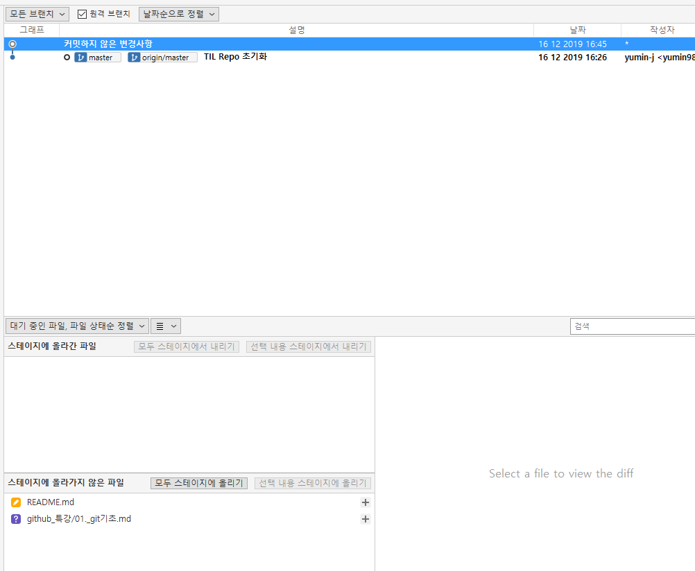
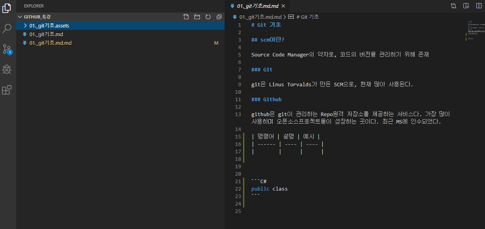
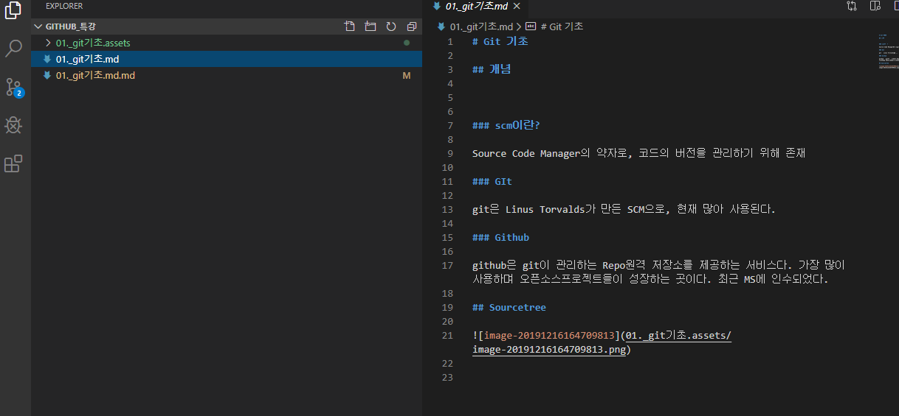
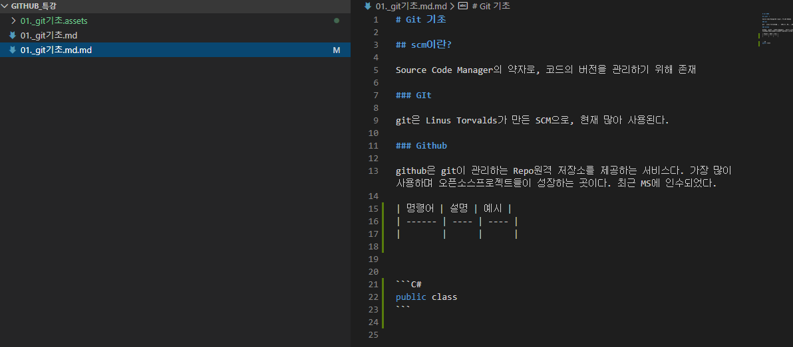
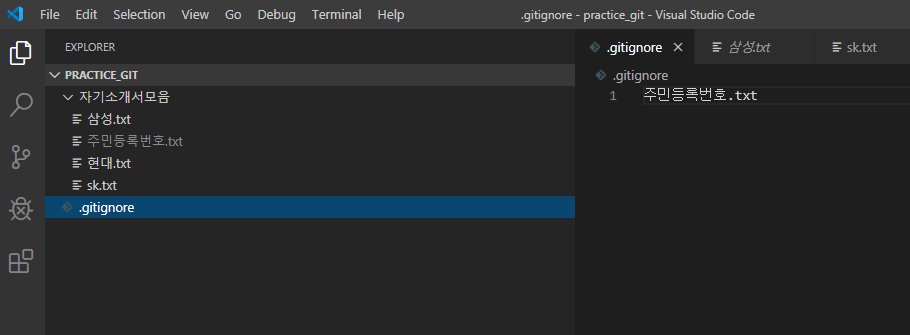

# Git 기초

## 개념

### scm이란?

Source Code Manager의 약자로, 코드의 버전을 관리하기 위해 존재

### GIt

git은 Linus Torvalds가 만든 SCM으로, 현재 많아 사용된다.

### Github

github은 git이 관리하는 Repo원격 저장소를 제공하는 서비스다. 가장 많이 사용하며 오픈소스프로젝트들이 성장하는 곳이다. 최근 MS에 인수되었다. 

## Sourcetree

## 수업내용 복습

* 먼저 프로그램이 깔려 있어야 한다. 깃허브와 소스트리, 타이프로 그리고 디렉터로 고칠 수 있었던 오픈 위드 코드가 있어야 한다.

* 먼저 홈에 있는 스튜덴트 폴더에서 임의의 파일을 만들고 그 안에 .gitignore을 깔고 텍스트 파일을 만든다. 그리고 소스트리를 접속해 

  create-> 만든파일명클릭-> tree를 스테이지로 올린다. 그리고 메세지에 적은 뒤 커밋을 한다.

* 이런식으로 올리고 커밋하고 올리고 커밋한다.

  * 만약 여기서 스테이지에 올리고 싶지 않은 파일이 있다면 이 파일은 오픈위드 코드로 들어가 지우고 싶은 폴더 쪽에 만들어져 있던 .gitignore에 지우고 싶은 파일명을 적는다. 만들어져 있지 않다면 파일로 .gitignore을 만들고 넣는다.
  * 이렇게 넣어버리고 싶은 것들을 넣어버리면 나중에 다 올리기 버튼으로 올려도 gitignore은 폴더이기 때문에 스테이지에 인식되지 않는다. 다 올린뒤 gitignore은 다시 내린다. 그리고 나머지 올린 것들을 메세지적은뒤 커밋한다.

* 계정을 만든다. +버튼을 눌러 새 창을 준비한 뒤 계정을 만드는 방법이 있고, 원격이나 설정을 눌러서 연결한다. 

* 나는 +을 눌러서 계정을 연동한 뒤 크롬 계정에서 깃허브로 들어간 후 그 곳에 URL을 복사한다.

* 소스트리로 다시 돌아와 소스트리 원격창이나 설정창으로 가서 계정과 URL을 적는다.

* 그럼 연동이 된 상태로 푸시버튼을 누르면 깃허브 계정으로 내 정보가 저장된다. 깃허브는 개발자의 커리어, 포트폴리오이기 때문에 이런 식으로 오늘 한 것들을 저장해두는 게 좋다. 가기 전에 한번해두거나 자기전에 한번씩 해두는 게 좋다. 

* 마지막 푸쉬를 한 뒤는 계정으로 들어가 확인해본다. 썼다 지웠다 한 것들도 다 적혀있으므로 잘 적어야 한다.

* 위에 것들을 타이포라에 적는다. 저장

* 

  

  

